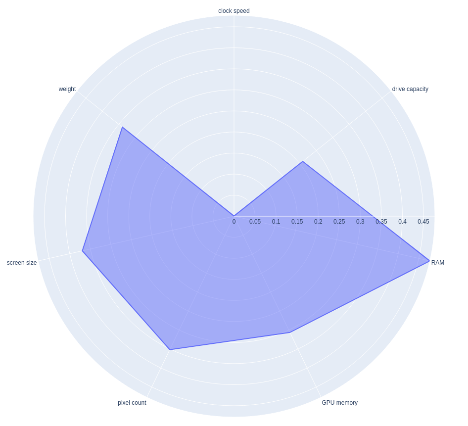
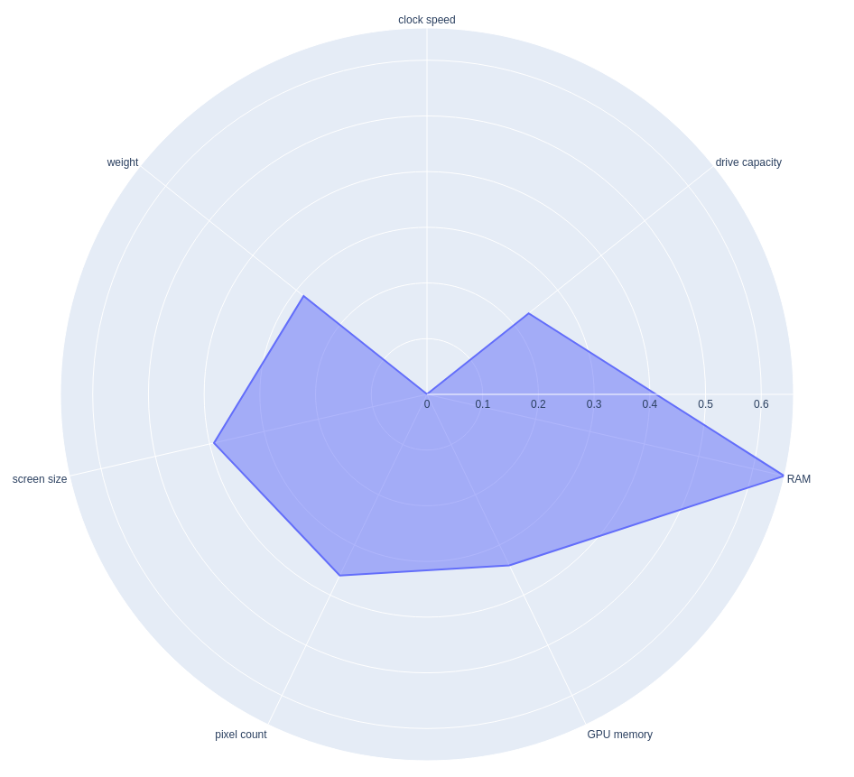
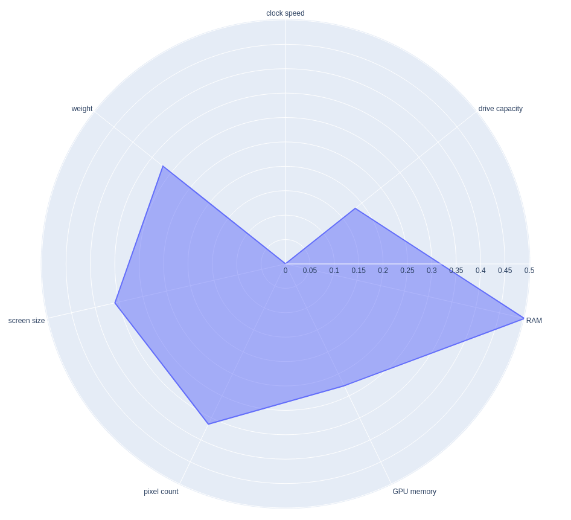
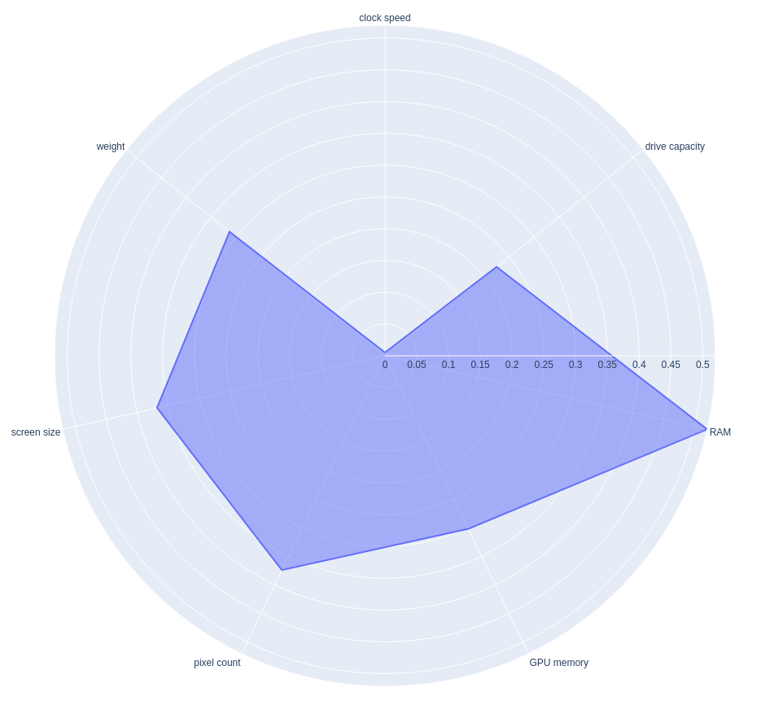

# Intro_to_datascience2023
This repository contains files used for a miniproject for the course Introduction to data science at the University of Helsinki in fall 2023.

The purpose of the project is to find out which brand provides the most value for money when buying a laptop. For this purpose we preprocessed data from a dataset found in [kaggle](https://www.kaggle.com/datasets/dhanushbommavaram/laptop-dataset) and computed scores for the following properties:
- processor clock speed (higher score means faster)
- hard/solid drive capacity (higher score means more capacity)
- RAM (random access memory) (higher score means more capacity)
- GPU (graphical processing unit) memory (higher score means more capacity)
- total number of pixels (higher score means more)
- screen size (higher score means larger)
- weight (higher score means heavier)

The original data is in the file **complete_laptop_data0.csv**. Preprocessing of the data is done in **project.ipynb**, which produces two preprocessed datasets **preprocessed_laptop_data.csv** and **preprocessed_laptop_data2.csv**, the former of which is used in **data_interaction.py** for computing the aforementioned scores.

### Results
##### The average score of all laptops in the dataset:

##### The average score of all laptops in the dataset that have a webcamera, microphone and speakers (and thus suitable for online meetings):

##### The average score of laptops by acer that are suitable for online meetings:

##### The average score of laptops by Nokia that are suitable for online meetings:

##### The average score of laptops by DELL that are suitable for online meetings:

##### The average score of laptops by ASUS that are suitable for online meetings:

